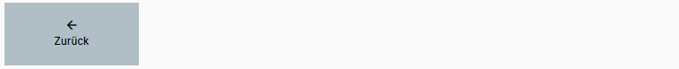
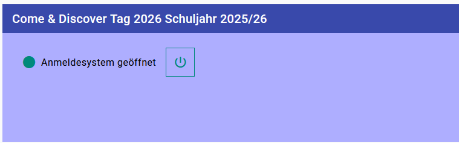
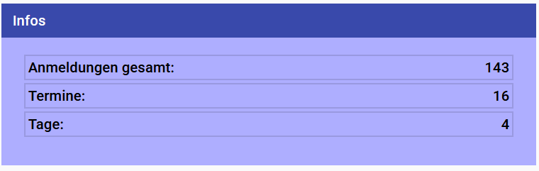
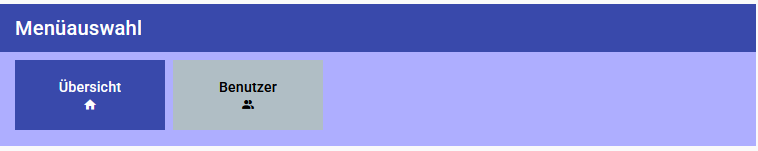

# Anmeldesystem Details

## Menüleiste

### Zurück

Mit dem **Zurück**-Button gelangen Sie zur Übersicht.

## Übersicht

Hier sehen Sie die Bezeichnung des Anmeldesystems. 

Ein **grüner Punkt** davor zeigt an, dass das System **eingeschaltet** ist (Benutzer können sich anmelden).

Ein **roter Punkt** zeigt an, dass das System **ausgeschaltet**, sprich inaktiv ist.

Mit dem **Ein-/Auschaltsymbol** kann das Anmeldesystem ein- oder ausgeschaltet werden.

## Infos

In der **Infos**-Box sehen sie

- die gesamte Anzahl der aktuellen Anmeldungen
- die Anzahl der Termine, an denen sich Benutzer anmelden können
- die Anzahl der Tage, die mit dem Anmeldesystem erfasst sind

## Menüauswahl

Hier kann man zwischen der **Ansicht aller Termine** oder der **Ansicht aller Benutzer** auswählen.

