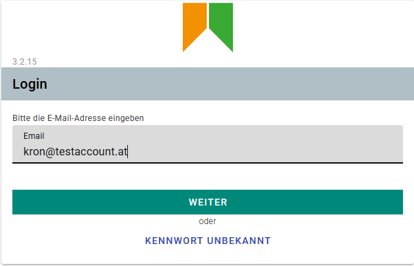
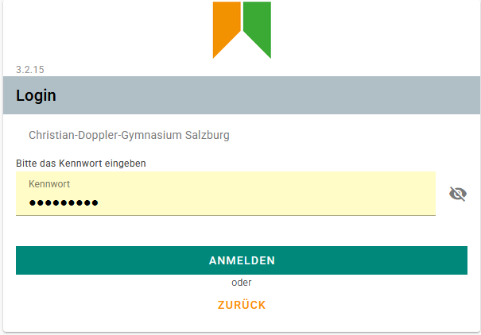
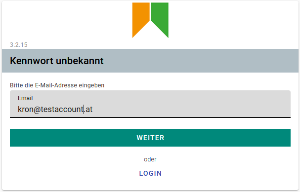
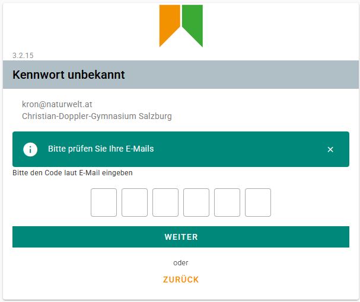
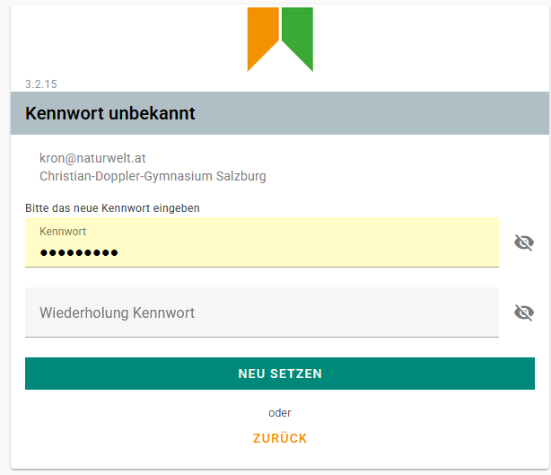
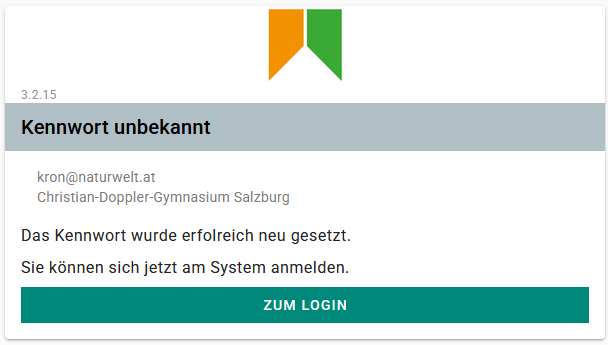

# Einloggen

## A. Das Kennwort ist bekannt

### Eingabe der E-Mail-Adresse

Geben Sie Ihre **E-Mail-Adresse** ein und klicken Sie auf **Weiter**:

### Eingabe des Kennwortes

Geben Sie Ihr **Kennwort** ein und klicken Sie auf **Anmelden**:

## A. Das Kennwort ist nicht bekannt

Klicken Sie auf **Kennwort unbekannt**

Geben Sie Ihre **E-Mail-Adresse** ein und klicken Sie auf **Weiter**:

Sie erhalten nun eine E-Mail mit einem **6-stelligen Code**.

Geben Sie den **Code** ein und klicken Sie auf **Weiter**:

Nun können Sie ein **neues Kennwort vergeben**. 
Wiederholen Sie dieses Kennwort und klicken danach auf **Neu setzen**:

Das Kennwort wurde neu gesetzt. Sie können sich nun einloggen. 
Klicken sie dazu auf **Zum Login**.

