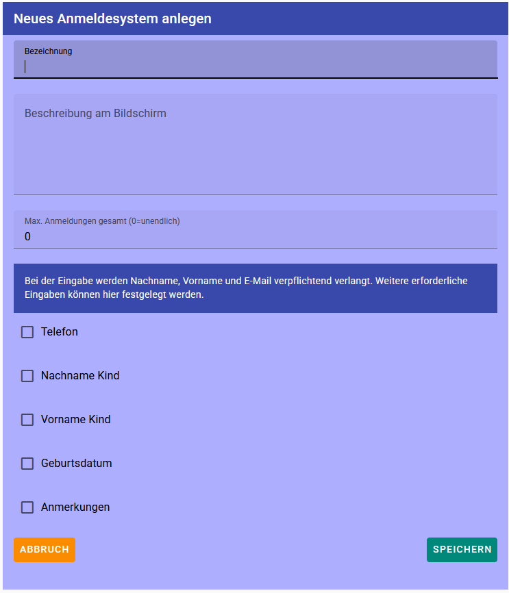

# Neues Anmeldesystem

Mit dem **Plus**-Symbol können Sie ein neues Anmeldesystem erstellen:

## Eingabefelder

### Bezeichnung

Bezeichnung des Anmeldesystems, zum Beispiel **Bewerbungsgespräche Schuljahr 2027/28**

### Beschreibung am Bildschirm

Dieser Text wird den Benutzern am Bildschirm als **zusätzliche Information** angezeigt.

### Max. Anmeldungen gesamt

Maximale Anzahl der Anmeldungen für den gesamten Event.

Beispiel: 300, d. h. zu diesem Event dürfen sich ingesamt nicht mehr als 300 Benutzer anmelden.

### Telefon, Nachname Kind ...

Alle angeklickten Eingabefelder kann der Benutzer eingeben. 
Sobald das Eingefeld angeklickt ist, erscheint nebenbei **Pflichtfeld**. 
Wenn das **Pflichtfeld** angeklickt ist, **muss** der Benutzer etwas eingeben.
