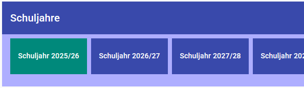
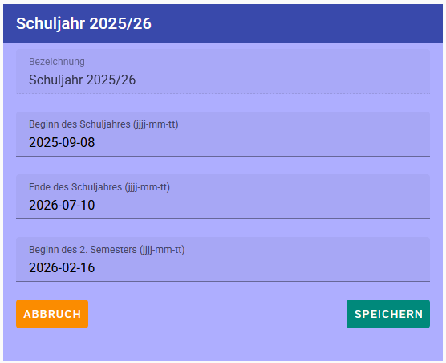
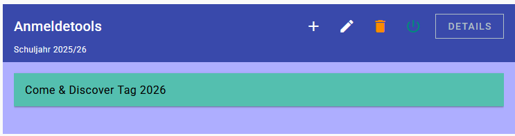

# Übersicht

Klicken Sie links auf **Anmeldetool**

## Schuljahre

Im obersten Bereich sind die **Schuljahre** zu sehen. 
Es kann jederzeit ein beliebiges Schuljahr ausgewählt werden.
**Alle weiteren Aktionen gelten für das ausgewählte Schuljahr**.

Ein Schuljahr kann auch geändert werden.
Klicken Sie dazu ganz rechts auf den Stift:

## Geöffnete Anmeldesysteme

Geöffnete Anmeldesysteme sind Anmeldesysteme, zu denen sich aktuell Benutzer anmelden können. 
**Anmeldesysteme sollten immer geschlossen werden, wenn die Anmeldefrist vorüber ist.**

In diesem Bereich sieht man alle geöffneten Anmeldesysteme:

Durch Klicken auf das **Ausschaltsymbol** kann das Anmeldesystem geschlossen werden. Ab diesem Zeitpunkt kann sich **niemand mehr an- oder abmelden**.

## Anmeldetools

In diesem Bereich sieht man alle Anmeldetools für das aktuelle Schuljahr:

### Mögliche Aktionen

- Mit dem **Plus**-Symbol kann man ein neues Anmeldesystem erstellen
- Mit dem **Stift**-Symbol kann man das markierte Anmeldesystem ändern
- Mit dem **Papierkorb**-Symbol kann man das markierte Anmeldesystem löschen
- Mit dem **Ein-/Ausschalten**-Symbol kann man das markierte Anmeldesystem zur Anmeldung ein- oder ausschalten
- Unter **Details** findet man alle Details zum markierten Anmeldesystem
