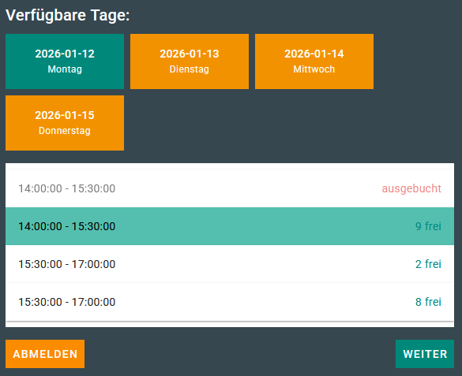

# Anmeldetool

Finden Sie heraus, wie das **Anmeldetool funktioniert - und das in weniger als fünf Minuten**.

## Wozu dient das Anmeldetool

Die Schule erstellt Events und gibt Termine vor.

Besucher können sich online zu den vorgegebenen Terminen anmelden.

Die Benutzer melden sich unkompliziert mit ihren Daten (Nachname, Vorname und weitere gewünschte Daten) an. 
Die E-Mail-Adressen werden dabei automatisch geprüft.

Die Benutzer können ihre gewünschten Termine buchen und diese selbständig wieder abändern oder stornieren.

Das Sekretariat erspart sich zahllose Telefonate **und wird somit deutlich entlastet!**

### Praktisches Beispiel

Die Schule erstellt einen Event **Beratungsgespräche zur Schulaufnahme** und erstellt verschiedene Termine für diese Gespräche. 
Diese Berratungstermine können Einzeltermine oder Gruppentermine sein. 

Der Benutzer wählt seinen geünschten Termin aus. **Fertig!**

